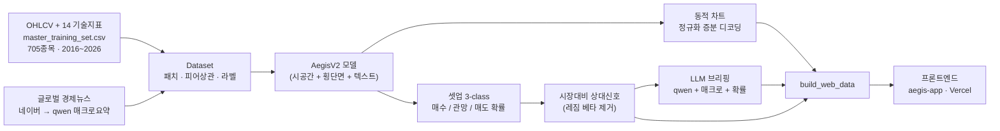
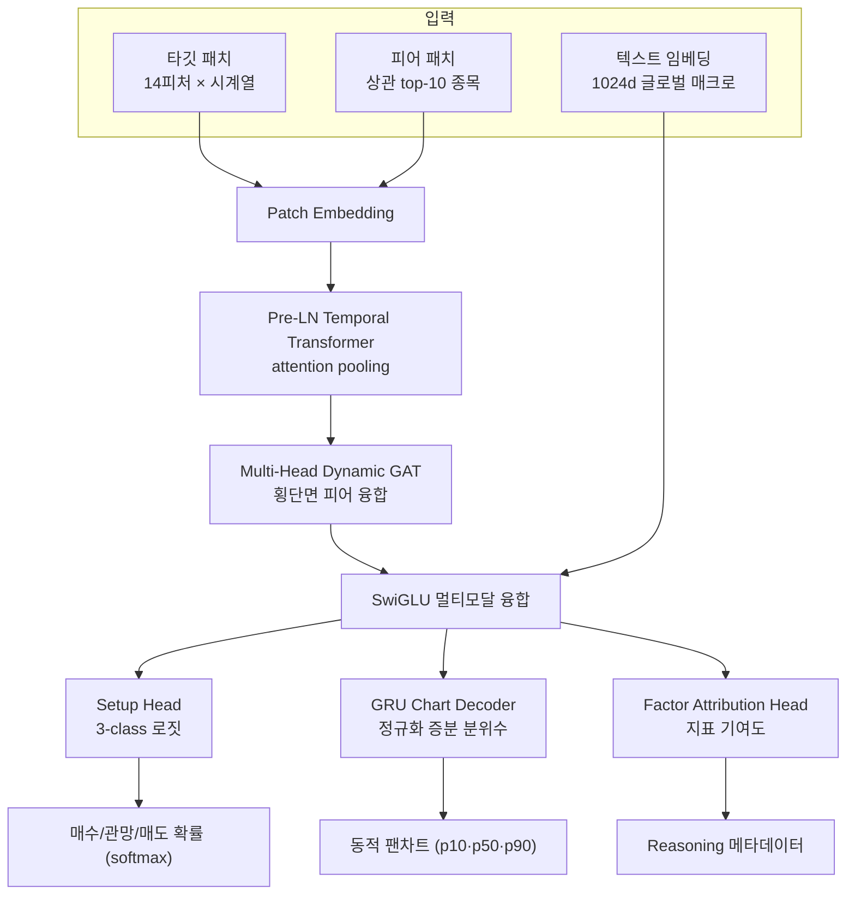

# Aegis — AI 주식 셋업 신호 모델

KOSPI · NASDAQ 종목에 대해 **딥러닝 셋업 신호(Buy / Wait / Sell 확률)**, **동적 예측 차트**, **LLM 투자 브리핑**을 생성하는 백엔드 모델입니다.
프론트엔드([`aegis-app`](aegis-app), Vercel 배포)는 이 모델의 산출물을 시각화만 합니다 — **모델 자체는 비배포(연구/배치 추론)용**입니다.

> ⚠️ 본 저장소의 모든 출력은 **투자 참고용**이며 매수·매도 권유가 아닙니다. 과거 데이터 기반 예측은 미래 수익을 보장하지 않습니다.

---

## 1. 파이프라인 개요



---

## 2. 모델 아키텍처 (`AegisV2AdvancedModel`)



| 블록 | 역할 |
|---|---|
| **Patch Embedding** | 14개 기술지표 시계열을 패치 단위로 임베딩 (patch_len 5, stride 2) |
| **Temporal Transformer** | 종목 자체의 추세·모멘텀 시계열 인코딩 (2 layers, 4 heads, attention pooling) |
| **Dynamic GAT** | 일별 상관 상위 10개 **피어 종목**과의 횡단면 관계 융합 |
| **SwiGLU Fusion** | 차트 특성 + **글로벌 매크로 텍스트**(qwen 요약 임베딩) 멀티모달 결합 |
| **Setup Head** | per-stock **3-class(매수/관망/매도) 로짓** → 신호 |
| **GRU Chart Decoder** | 일별 **정규화 증분 분위수**를 자기회귀로 생성 → 종목 σ로 디코딩하면 주가차트처럼 동적 |
| **Factor Attribution** | 어떤 지표를 중시했는지(LLM 브리핑용 메타) |

핵심 사양: `embed_dim 256 · 14 features · 10 peers · aux/signal horizon 20일`

---

## 3. 신호 정의 — per-stock 리스크조정 셋업 (3-class)

"어느 종목이 1등인가(횡단면 랭킹 = 모멘텀 모방)"가 아니라 **"지금 이 종목이 사기 좋은 자리인가(타이밍·셋업)"**를 직접 학습합니다.

- **라벨**: 향후 `H`일 내 `+barrier`를 `-barrier`보다 먼저 치면 **매수(Buy)**, 반대면 **매도(Sell)**, 둘 다 안 닿으면 **관망(Wait)**.
- `barrier = clip(σ_daily · √H · mult, 4%, 30%)` — 종목 변동성에 맞춤.
- **손실**: `AegisSetupChartLoss` = 클래스 역빈도 가중 **CrossEntropy** + 보조 차트 **Pinball**.
- **서빙 신호**: MA3 평활한 확률을 **시장(KOSPI/NASDAQ) 평균 대비 상대화**(레짐 베타 제거)해 매수/관망/매도 부여 → 강세장에도 차별화·매도 신호가 정상 발생.

---

## 4. 학습 · 검증

- **분할**: 엄격한 시계열 train/val + **Purge + Embargo**(라벨 누수 차단).
- **최적화**: AdamW + OneCycleLR + AMP(RTX 3090). 체크포인트 선택 = **Buy-vs-rest AUC**.
- **OOS 게이트**: `run_rank_backtest.py` — 신호의 Rank-IC·수익·붕괴(분산) 점검.

### 정직한 한계 (Design Notes)

이 프로젝트는 여러 타깃/손실을 실험하며 **정직하게 검증**했습니다:

| 시도 | 결과 |
|---|---|
| 초기 survival-hazard | OOS Rank-IC **음수**(MAE 라벨 편향 → 평균회귀 학습) |
| 횡단면 forward-return 회귀 | **모멘텀 모방** + 서빙에서 상수 붕괴 |
| **per-stock 셋업 3-class (현재)** | 붕괴 없음·레짐 반응·깔끔한 확률 ✅ / 단 **OOS 예측 edge ≈ 0** |

→ **근본 원인은 입력 천장**: 입력이 전부 OHLCV 파생 기술지표라, 모델이 찾을 수 있는 상한이 "기술지표의 비선형 조합"이고 실증적으로 그건 단순 모멘텀 이하입니다.
→ **진짜 edge의 길**: 비기술 입력(외국인·기관 **일별 수급**, 펀더멘털)을 추가해야 합니다. 수급은 KRX 로그인이 필요해 [`collect_flow.py`](aegis_trade_v2/collect_flow.py)로 수집 후 통합하도록 준비돼 있습니다.

> 즉 **신호는 깨끗하고 AI다운(비모멘텀) 형태로 동작하지만, 시장 초과수익(alpha)은 입력 보강 전까지 보장하지 않습니다.** 이를 숨기지 않고 명시합니다.

---

## 5. 저장소 구조

```
aegis_trade_v2/
├── model/aegis_v2.py          # 모델 (Patch·Transformer·GAT·Fusion·헤드)
├── model/utils/loss_util.py   # AegisSetupChartLoss 등
├── dataset/dataset.py         # 피처 엔지니어링 + 셋업 라벨
├── train.py                   # 학습 (Purge+Embargo, AMP, Buy-AUC 선택)
├── run_rank_backtest.py       # OOS Rank-IC 게이트
├── backtest_state_signal.py   # 상태머신 신호 포트폴리오 백테스트
├── collect_flow.py            # (입력 보강) KRX 수급/펀더멘털 수집기
└── configs/aegis_v2.yaml      # 단일 설정 소스
service/
├── run_daily_market_pred.py   # 일일 배치: 추론 → 신호 → LLM 브리핑
└── inference/                 # 파이프라인 · 매크로뉴스 · reasoning(qwen)
build_web_data.py              # 프론트 JSON 빌드
aegis-app/                     # 프론트엔드(React·Vercel) — 시각화 전용
```

---

## 6. 실행

```bash
# 학습
python aegis_trade_v2/train.py

# OOS 검증 게이트
python aegis_trade_v2/run_rank_backtest.py -u KOSPI_100 NASDAQ_100

# 일일 추론 + 브리핑 (Ollama qwen 필요)
python -m service.run_daily_market_pred --days 1 --force

# 프론트 데이터 빌드
python build_web_data.py
```

설정은 [`aegis_trade_v2/configs/aegis_v2.yaml`](aegis_trade_v2/configs/aegis_v2.yaml) 한 곳에서 제어합니다.
